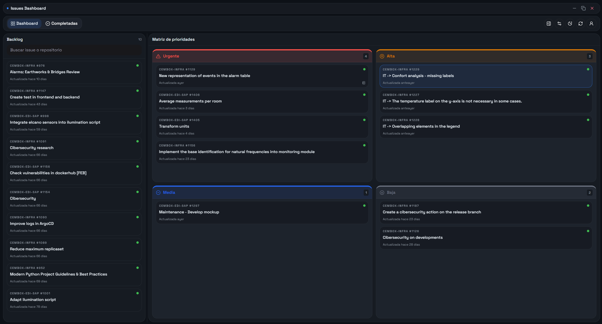

# Issues Dashboard



Aplicación de escritorio local-first para centralizar issues de GitHub, campos de Projects, Pull Requests, prioridades y notas privadas. El destino de producción es una aplicación autocontenida para Windows; el modo web se mantiene para desarrollo y revisión.

Documentación en inglés: [README.md](README.md).

## Qué incluye

- Issues asignadas en GitHub, excluyendo Epics.
- Separación clara entre el estado de GitHub (`Abierta`/`Cerrada`) y el `Status` de Projects.
- Filtros dinámicos únicamente para Status, Sprint y Priority.
- Tablero local de prioridades, fijado, revisión/cierre y notas estructuradas.
- Panel de Pull Requests dividido entre las solicitadas por ti y las que requieren tu revisión, con filtros independientes.
- Caché SQLite inmediata; GitHub solo se consulta mediante una sincronización explícita o programada.
- Una copia portátil que contiene base de datos y ajustes.
- Token controlado por Electron y cifrado con las credenciales seguras del sistema operativo.

## Arquitectura

```text
apps/
  api/       Casos de uso FastAPI, adaptadores GitHub, SQLite, migraciones y copias
  web/       UI estática Next.js, HeroUI e interacciones locales optimistas
  desktop/   Runtime Electron en TypeScript y empaquetado determinista de Windows
scripts/     Orquestación de desarrollo del monorepo
```

La UI nunca llama directamente a GitHub. Las lecturas salen de la API local y de SQLite. `POST /api/synchronization` es el único comando de refresco remoto general: actualiza issues, los tres campos necesarios de Projects, PRs enlazadas y el panel de PRs mediante una operación única que no se solapa consigo misma.

SQLite utiliza WAL, conexiones cortas, proyecciones normalizadas e indexadas, upserts condicionales y migraciones de esquema. Al actualizar una base antigua, sus proyecciones JSON se migran a las tablas normalizadas sin exigir otro refresco de GitHub.

## Token de GitHub

La app solo solicita un token y obtiene automáticamente la cuenta real mediante `/user`; no hay nombres de cuenta hardcodeados ni un campo manual de usuario.

Con GitHub CLI, selecciona la cuenta adecuada y concede lectura de Projects:

```powershell
gh.exe auth switch --hostname github.com --user TU_CUENTA
gh.exe auth refresh --hostname github.com --scopes read:project
gh.exe auth status --hostname github.com
gh.exe auth token --hostname github.com --user TU_CUENTA
```

El token también necesita acceso a los repositorios cuyas issues y Pull Requests quieras consultar. Trátalo como una contraseña y no lo guardes en ningún archivo versionado.

## Preparación

Requisitos:

- Node.js 22+
- npm 10+
- Python 3.13+
- `uv` disponible como módulo de Python (`python -m pip install uv`)

```powershell
npm install
npm run backend:venv
npm run backend:sync
```

Una vez creado el entorno, los scripts detectan automáticamente `apps/api/.venv/Scripts/python.exe`. Los comandos funcionan igual desde PowerShell, CMD y la terminal integrada de VS Code.

## Modos de ejecución

Desarrollo web con FastAPI y Next.js:

```powershell
npm run dev
```

- Interfaz: `http://127.0.0.1:3000`
- API: el lanzador usa `8010` si está libre o reserva dinámicamente otro puerto local.

Desarrollo de escritorio con API gestionada por Electron:

```powershell
npm run dev:desktop
```

Paquete de producción:

```powershell
npm run build:desktop
```

Salida:

```text
apps/desktop/release/GitHub Issues Dashboard-win32-x64/GitHub Issues Dashboard.exe
```

El empaquetado recompila siempre la web estática y la API PyInstaller en formato `onedir`, evitando mezclar artefactos antiguos con código nuevo.

## Comandos de calidad

```powershell
npm run format:check
npm run lint
npm run test
npm run verify
```

`npm run verify` también genera el paquete de escritorio completo.

## Configuración

Copia [apps/api/.env.example](apps/api/.env.example) como `apps/api/.env.local` únicamente si necesitas personalizar el modo web. Electron inyecta en cada ejecución su puerto aleatorio, secreto interno, rutas de datos y token cifrado.

Variables relevantes:

- `DASHBOARD_API_HOST`, `DASHBOARD_API_PORT`: escucha de la API local.
- `GITHUB_TOKEN`: token opcional solo para desarrollo web.
- `GITHUB_API_BASE_URL`: URL de GitHub, útil para pruebas o GitHub Enterprise.
- `GITHUB_REQUEST_TIMEOUT_SECONDS`, `GITHUB_MAX_PAGES`: límites del trabajo remoto.
- `ISSUES_DATABASE_PATH`: ubicación de SQLite.
- `DASHBOARD_PREFERENCES_PATH`: ubicación de los ajustes portátiles.
- `GITHUB_SESSION_PATH`, `GITHUB_SESSION_KEY_PATH`: sesión cifrada del modo web.
- `DASHBOARD_DESKTOP_MODE`, `DASHBOARD_RUNTIME_SECRET`: protección interna usada por Electron.
- `NEXT_PUBLIC_API_BASE_URL`: API usada por la web; normalmente la inyecta el lanzador.

No hay variables de Turso/libSQL ni de despliegue cloud: esta rama está diseñada deliberadamente como aplicación local de escritorio.

## Resumen de la API

- `GET /health`: estado y versiones de API, contrato y esquema.
- `GET /api/issues/snapshot?compact=true`: snapshot SQLite ligero.
- `GET /api/issues/{issue_key}`: detalle completo local.
- `POST /api/synchronization`: refresco unificado de GitHub.
- `GET /api/synchronization/status`: estado local de sincronización.
- `GET /api/github/pull-requests`: PRs cacheadas dentro del historial configurado.
- `GET|PUT /api/preferences`: ajustes portátiles.
- `POST /api/backups/export|inspect|import`: copias completas y validadas.
- `/api/issues/*`: cambios locales de prioridad, fijado, cierre y notas.
- `/api/session/*`: sesión cifrada utilizada únicamente en desarrollo web.

## Persistencia y copias

Electron guarda los datos de cada equipo en su directorio `userData`:

- `issues.db`: issues, campos de Projects, Pull Requests, reviewers y flujo local.
- `preferences.json`: tema, zoom, ventanas históricas, refresco y panel lateral.
- `session.json`: token cifrado mediante `safeStorage` y cuenta real resuelta.
- `window-state.json`: posición y tamaño de ventana específicos del equipo; no se exportan.
- `desktop.log` y `desktop.log.1`: logs de diagnóstico con tamaño limitado.

El archivo `.issues-dashboard-backup` incluye una instantánea SQLite consistente, preferencias, manifiesto versionado y hashes SHA-256. Antes de sustituir nada, la importación valida tamaños, hashes, esquema, ajustes e integridad SQLite, avisa si cambia la cuenta y crea una copia automática recuperable del estado anterior.

## Seguridad y fiabilidad

- Electron es el único propietario del token en producción; el renderer no lo recibe.
- La API embebida escucha solo en loopback y exige un secreto aleatorio por ejecución salvo en `/health`.
- El preload expone un bridge IPC reducido y aislado; la integración de Node está desactivada.
- Electron verifica el contrato de la API antes de mostrar la aplicación y reinicia el backend un número limitado de veces si se cae.
- Las consultas usan pooling, historial acotado, ETags para páginas REST, cachés GraphQL cortas y solo los campos que muestra la app.
- Si GitHub falla, se conserva la última proyección SQLite válida y el aviso aparece como toast.

## Problemas habituales

- Si no aparecen campos de Projects, ejecuta el comando `gh.exe auth refresh ... --scopes read:project` anterior y vuelve a pegar el token.
- Si PowerShell abre un selector de aplicación al escribir `gh`, utiliza expresamente `gh.exe`.
- Los fallos del runtime de escritorio quedan en `desktop.log` dentro de `userData`.
- Cierra el ejecutable empaquetado antes de recompilar si Windows informa de archivos bloqueados.
