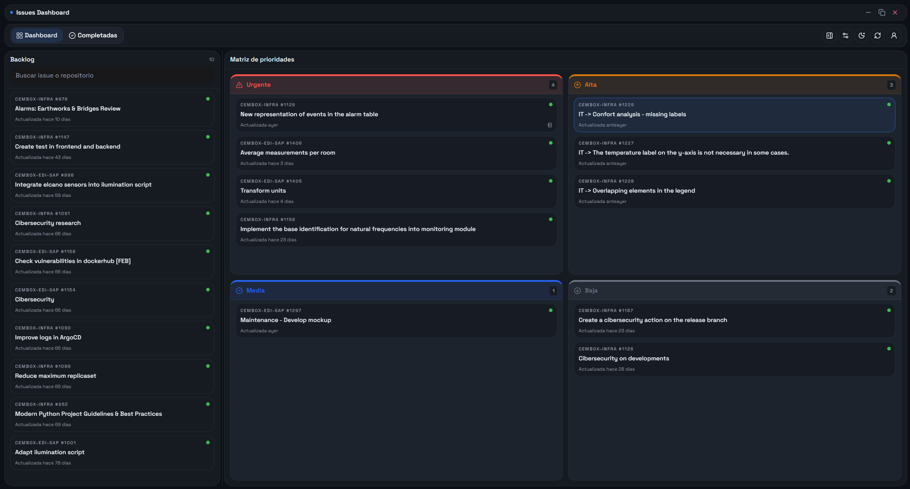

# Issues Dashboard



Local-first GitHub triage workspace for assigned issues, available as a browser app and as a native desktop shell.

Spanish documentation is available in [README.es.md](README.es.md).

## Table of Contents

1. [Overview](#overview)
2. [Core Features](#core-features)
3. [Architecture](#architecture)
4. [Runtime Modes](#runtime-modes)
5. [API Overview](#api-overview)
6. [Configuration](#configuration)
7. [Getting Started](#getting-started)
8. [Quality Commands](#quality-commands)
9. [Desktop Packaging (Windows)](#desktop-packaging-windows)
10. [Security Model](#security-model)
11. [Troubleshooting](#troubleshooting)

## Overview

Issues Dashboard is designed for developers who want fast, low-friction prioritization of GitHub issues assigned to them.

The project combines:

- A Next.js frontend for issue triage and note-taking.
- A FastAPI backend that merges live GitHub data with local state.
- An Electron desktop shell that embeds the backend and persists user data locally.

The app is intentionally local-first: issue organization, notes, and completion state are persisted in a local SQLite database so your workflow remains responsive even when GitHub is temporarily unavailable.

## Core Features

- Priority-based board (Backlog, P1-P4, completed lane).
- Local issue state per item:
  - priority
  - pinned status
  - completion status
  - structured note blocks
- Incremental synchronization with optimistic UI updates.
- Closed-issue visibility window filter (`1`, `3`, `6`, `12`, or `all` months).
- Local GitHub session management.
- Desktop controls for importing/exporting the local SQLite database.

## Architecture

## Monorepo Layout

```text
apps/
  api/       FastAPI + domain/application/infrastructure layers
  web/       Next.js App Router UI
  desktop/   Electron shell and packaging scripts
scripts/     root orchestration helpers
```

## Backend (`apps/api`)

The backend follows a layered design:

- `dashboard_api/app`
  - FastAPI composition root (`create_app`), dependency wiring, CORS, lifespan hooks.
- `dashboard_api/application`
  - Use-case services for snapshot generation, local-state commands, and session orchestration.
- `dashboard_api/domain`
  - Domain models and defaults for tracked issues and note blocks.
- `dashboard_api/infrastructure`
  - GitHub REST client (`httpx`), SQLite repository, encrypted local session store.
- `dashboard_api/presentation/http`
  - Route handlers and Pydantic request/response schemas.

Request lifecycle for snapshot loading:

1. Frontend requests `GET /api/issues/snapshot?closed_window=...`.
2. `IssueDashboardSnapshotService` attempts a GitHub refresh when credentials are available.
3. `SqliteTrackedIssueRepository` updates the remote projection and merges local state.
4. The API returns a normalized payload (`issues` + `meta`) for UI rendering.

When GitHub is unreachable, the service falls back to cached local data instead of failing hard.

## Frontend (`apps/web`)

The frontend is a client-heavy Next.js app focused on triage speed:

- `src/features/issues-dashboard/dashboard-app.tsx`
  - Main orchestration state machine (session, snapshot loading, sync queues, filters).
- `src/features/issues-dashboard/dashboard-board.tsx`
  - Board and lanes, drag/drop interactions, priority actions.
- `src/features/issues-dashboard/dashboard-chrome.tsx`
  - Desktop-like chrome, session screen, description modal.
- `src/features/issues-dashboard/api.ts`
  - HTTP client layer for backend routes.

Interaction model:

- Reads snapshot data from the backend.
- Applies optimistic local updates.
- Syncs mutations through dedicated endpoints (`priority`, `pin`, `completion`, `notes`, `sync-state`).

## Desktop Shell (`apps/desktop`)

Electron provides native runtime concerns while keeping UI logic in `apps/web`:

- `main.cjs`
  - Creates window, manages backend process lifecycle, logs runtime events, handles IPC.
- `preload.cjs`
  - Exposes a narrow `window.githubIssuesDesktop` bridge.
- `session-store.cjs`
  - Encrypts desktop session payloads.

Desktop startup flow:

1. Electron reserves a local API port.
2. BrowserWindow is created with `--api-base-url` argument.
3. If a local session exists, Electron starts the embedded backend and waits for `/health`.
4. The frontend consumes APIs through the injected base URL.

## Runtime Modes

## 1) Web Mode (API + Web)

Use this for browser-only development.

- `npm run dev`
  - Starts `@dashboard/api` and `@dashboard/web` through Turbo.
  - Dynamically resolves an available API port and injects `NEXT_PUBLIC_API_BASE_URL`.

## 2) Desktop Mode (Web + Electron + Embedded API)

Use this for desktop behavior, IPC, and packaging-related validation.

- `npm run dev:desktop`
  - Starts `@dashboard/web` and `@dashboard/desktop`.
  - Backend runs as an Electron-managed local process (not as a separate Turbo app).

## API Overview

Base path is provided by runtime (`http://127.0.0.1:<port>` in local dev).

Issue routes:

- `GET /api/issues/snapshot`
- `POST /api/issues/sync-state`
- `PATCH /api/issues/state`
- `PATCH /api/issues/priority`
- `PATCH /api/issues/pin`
- `PUT /api/issues/completion`
- `PUT /api/issues/notes`

Session routes:

- `GET /api/session/status`
- `POST /api/session`
- `DELETE /api/session`

Health route:

- `GET /health`

## Configuration

Common environment variables:

- `DASHBOARD_API_PORT`
  - API listening port (default: `8010`, dynamic in web dev orchestration).
- `NEXT_PUBLIC_API_BASE_URL`
  - Frontend API base URL (usually injected by dev scripts).
- `GITHUB_TOKEN`
  - Optional fallback token when no local session is stored.
- `GITHUB_USERNAME`
  - Optional fallback username associated with `GITHUB_TOKEN`.
- `ISSUES_DATABASE_PATH`
  - SQLite file path for tracked issues.
- `GITHUB_SESSION_PATH`
  - Local encrypted session metadata path.
- `GITHUB_SESSION_KEY_PATH`
  - Local encryption key path for backend session store.

`apps/api/.env.local` and `apps/web/.env.local` are ignored by git for local-only configuration.

## Getting Started

Prerequisites:

- Node.js 22+
- npm 10+
- Python 3.13+
- `uv` (`python -m pip install uv`)

Install dependencies and bootstrap the backend environment:

```bash
npm install
npm run backend:venv
npm run backend:sync
```

Run browser mode:

```bash
npm run dev
```

Run desktop mode:

```bash
npm run dev:desktop
```

## Quality Commands

Run all validation steps:

```bash
npm run verify
```

Individual commands:

```bash
npm run lint
npm run test
npm run build
```

Backend-only commands:

```bash
npm run backend:dev
npm run backend:test
npm run backend:lint
npm run backend:format
```

## Desktop Packaging (Windows)

Build full desktop distribution:

```bash
npm run build:desktop
```

Expected output:

```text
apps/desktop/release/GitHub Issues Dashboard-win32-x64/GitHub Issues Dashboard.exe
```

For distribution via GitHub Releases, package the folder:

```text
apps/desktop/release/GitHub Issues Dashboard-win32-x64/
```

## Security Model

- Local env files are excluded from version control.
- GitHub tokens are never committed in this repository.
- Backend local session store (`apps/api`) encrypts tokens using NaCl (`SecretBox`) with per-machine key material.
- Desktop session record uses `tweetnacl`; the master key is wrapped with Electron `safeStorage` when available.
- Runtime data (session and SQLite) is stored in user-local application data directories.

## Troubleshooting

- Port conflicts in web mode:
  - The dev launcher retries with an available API port.
  - Frontend defaults to `http://127.0.0.1:3000`.
- Desktop backend not ready:
  - Verify a local GitHub session exists in the desktop login screen.
  - Check runtime log file under the app user-data directory (`desktop.log`).
- Windows packaging file locks:
  - Ensure no packaged executable is still running before rebuilding.
  - If icon embedding fails intermittently, close Explorer previews and retry.

## Project Status

This repository is currently maintained as a private project.
